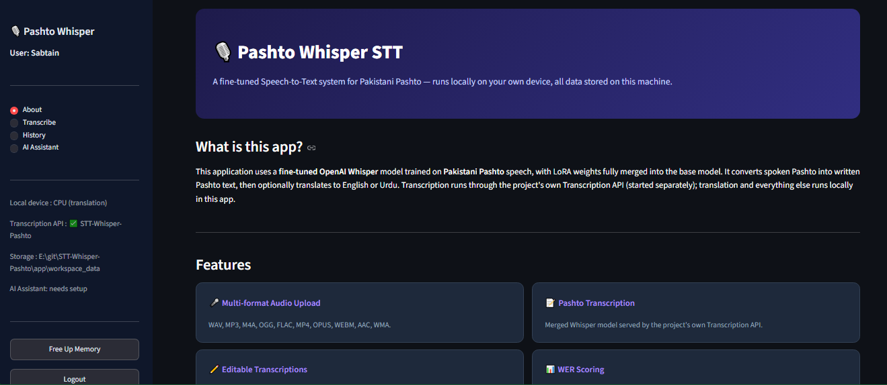
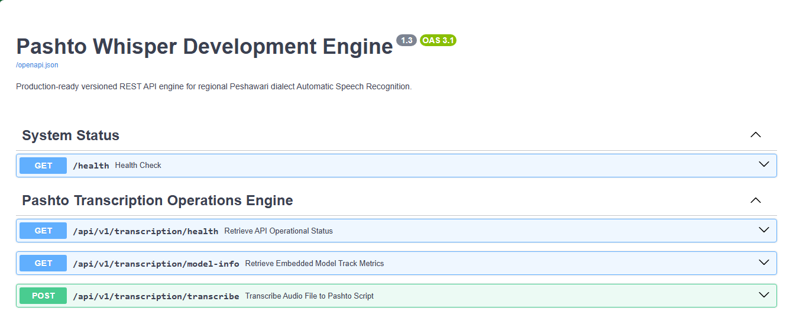

# Speech-to-Text Finetuning on Regional Language (Pashto)

[](https://github.com/Sabtain-Dev/STT-Whisper-Pashto/actions)
[](https://www.python.org/)
[](https://fastapi.tiangolo.com/)
[](https://streamlit.io/)
[](https://www.docker.com/)
[](https://huggingface.co/Sabtain-Dev/STT-Whisper-Pashto)
[](https://www.kaggle.com/datasets/itssabtain/pashto-asr-dataset)
[](LICENSE)

An end-to-end Automatic Speech Recognition (ASR) system for Pakistani Pashto built by fine-tuning OpenAI Whisper using LoRA. The project includes a FastAPI backend, Streamlit frontend, Docker support, GitHub Actions CI, and Hugging Face integration for datasets and models.

---

## 📋 Table of Contents
- [Project Overview](#project-overview)
- [Features](#features)
- [Architecture](#architecture)
- [Screenshots](#screenshots)
- [Demo Video](#demo-video)
- [Dataset](#dataset)
- [Finetuned Model](#finetuned-model)
- [Hugging Face Spaces](#hugging-face-spaces)
- [Project Statistics](#project-statistics)
- [Project Structure](#project-structure)
- [Installation](#installation)
- [Docker Deployment](#docker-deployment)
- [API Documentation](#api-documentation)
- [Performance and Benchmarks](#performance-and-benchmarks)
- [Testing](#testing)
- [Continuous Integration](#continuous-integration)
- [Security and Technical Specs](#security-and-technical-specs)
- [Roadmap](#roadmap)
- [Citation](#citation)
- [License](#license)
- [Acknowledgements](#acknowledgements)
- [Contact](#contact)

---

## 🎯 Project Overview
This project presents an end-to-end, resource-efficient Speech-to-Text (ASR) solution designed to bridge the gap for low-resource regional languages. By applying Low-Rank Adaptation (LoRA) to OpenAI's Whisper-Small architecture, the system achieves robust recognition capabilities for **Pakistani Regional Pashto**. It features a decoupled production setup: an interactive Streamlit frontend for end-users and a high-performance FastAPI microservice backend for model inference.

---

## ✨ Features
- **Pashto Speech Recognition:** Fine-tuned OpenAI Whisper-Small model adapted specifically for Pakistani Pashto.
- **PEFT / LoRA Fine-Tuning:** Resource-efficient parameter adaptation merged into lightweight deployment checkpoints.
- **FastAPI REST Service:** Modular, versioned API handling audio preprocessing, model queuing, and transcription responses.
- **Streamlit Web Dashboard:** Interactive interface supporting file uploads, text editing, translation (English/Urdu), WER evaluation, and user authentication.
- **Dockerized Multi-Container Setup:** Production-ready orchestration using Docker Compose for frontend and backend microservices.
- **Hugging Face & Kaggle Integration:** Direct pipeline integration with open-sourced model hubs and linguistic datasets.
- **Automated CI/CD:** GitHub Actions workflows covering automated syntax checking, static linting, and integration testing with Pytest.
- **Structured Logging & Diagnostics:** Full audit trails with native timestamped logger tracking execution boundaries and performance.

---

## 🏗️ Architecture

The application adopts a decoupled, multi-tier architecture separating the client presentation layer from machine learning inference engines.

```text
┌─────────────────┐   HTTP Requests (POST /transcribe)   ┌─────────────────┐
│                 │ ───────────────────────────────────> │                 │
│    Streamlit    │                                      │     FastAPI     │
│   Frontend UI   │ <─────────────────────────────────── │  Inference Core │
│                 │       Structured JSON Response       │  (Whisper/LoRA) │
└─────────────────┘                                      └─────────────────┘
```

---

## 📸 Screenshots

<div align="center">

| Streamlit Interactive UI | FastAPI Swagger Portal |
| :---: | :---: |
|  |  |

</div>

---

## 🎥 Demo Video

Watch the complete walkthrough and live demonstration on YouTube:

▶️ **[Pashto Speech-to-Text System Demonstration](https://youtu.be/vtoy1w7FSd0)**

---

## 📊 Dataset

The model training and evaluations were driven by a custom, curated regional linguistic corpus containing over 5,000 targeted audio recordings.

* **Repository:** [Pashto ASR Dataset on Kaggle](https://www.kaggle.com/datasets/itssabtain/pashto-asr-dataset)
* **Sample Count:** 5,000+ audio clips
* **Domains Covered:** Agriculture, Food, Services, Health, and General Conversation
* **Audio Format:** High-quality WAV recordings

---

## 🤗 Finetuned Model

The fine-tuned Whisper-LoRA checkpoint is open-sourced and hosted directly on Hugging Face:

* **Repository:** [Sabtain-Dev/STT-Whisper-Pashto](https://huggingface.co/Sabtain-Dev/STT-Whisper-Pashto)
* **Base Architecture:** OpenAI Whisper-Small
* **Fine-Tuning Method:** Low-Rank Adaptation (LoRA / PEFT)
* **Word Error Rate (WER):** **43.83%** (Evaluated down from a baseline error rate of >100%)

---

## 🤗 Hugging Face Spaces

The hugging face space is live at: [Sabtain-Dev/STT-Whisper-Pashto-Spaces](https://huggingface.co/spaces/codewithjarair/Pashto-stt)

---

## 📈 Project Statistics

| Parameter | Specification |
| --- | --- |
| **Target Language** | Pashto (Pakistani Dialect) |
| **Dataset Size** | 5,000+ Audio Samples |
| **Linguistic Domains** | Agriculture, Food, Services, Health, General |
| **Model Architecture** | Whisper-Small + LoRA |
| **Target WER** | 43.83% |
| **Backend Engine** | FastAPI (Python 3.10) |
| **Frontend UI** | Streamlit |
| **Orchestration** | Docker / Docker Compose |
| **Continuous Integration** | GitHub Actions |

---

## 📁 Project Structure

```text
STT_Whisper_Pashto/
├── api/                   # Production FastAPI Backend Layer & Routes
├── app/                   # Streamlit Interactive User UI Frontend
├── app_testing_collab/    # Testing collab notebook for Streamlit App
├── assets/                # Static Assets (Images, Icons, Screenshots)
├── utils/                 # Core Machine Learning Inference & Audio Utilities
├── notebooks/             # Fine-tuning & Evaluation Labs
├── tests/                 # Automated Unit and Integration Test Suite
├── configs/               # Static Application Configuration Specifications
├── .dockerignore          # Docker Ignore File for Build Context
├── Dockerfile.fastapi     # Docker Build Spec for Backend Service
├── Dockerfile.streamlit   # Docker Build Spec for Frontend Service
├── docker-compose.yml     # Multi-Container Orchestration Blueprint
├── .gitignore             # Git Ignore File for Version Control
├── requirements.txt       # Python Dependency Manifest
├── CHANGELOG.md           # Versioned Change Log
└── README.md              # Project Master Overview

```

---

## ⚙️ Installation

### Prerequisites

* Python 3.10
* `ffmpeg` (Required for audio processing)

### Local Setup

1. **Clone the Repository:**
```bash
git clone https://github.com/Sabtain-Dev/STT-Whisper-Pashto.git
cd STT-Whisper-Pashto

```

2. **Set Up Environment:**
```bash
python -m venv venv
source venv/bin/activate  # On Windows: .\venv\Scripts\activate
pip install -r requirements.txt

```

3. **Configure Environment Variables:**
```bash
cp .env.example .env

```

4. **Launch Application Backend & Frontend:**
```bash
# Terminal 1: FastAPI Backend
python -m uvicorn api.main:app --reload

# Terminal 2: Streamlit Frontend
streamlit run app/app.py

```

---

## 🐳 Docker Deployment & Quick Start

Pre-built container images are published on Docker Hub. You do not need to build the project from source or install local machine learning dependencies.

* 📦 **API Image:** [`msabtainkhan/stt-whisper-pashto-api:v1.0`](https://hub.docker.com/r/msabtainkhan/stt-whisper-pashto-api)
* 📦 **Frontend Image:** [`msabtainkhan/stt-whisper-pashto-streamlit:v1.0`](https://hub.docker.com/r/msabtainkhan/stt-whisper-pashto-streamlit)

### 🚀 Launching the App Locally

1. **Clone the repository:**
   ```bash
   git clone (https://github.com/Sabtain-Dev/STT-Whisper-Pashto.git)
   cd STT-Whisper-Pashto
   ```

2. **Run With Docker Compose**
    ```bash
    # Launch the interconnected services
    docker compose up
    ```
3. **Access The Application**
* **Frontend Application:** http://localhost:8501
* **FastAPI OpenAPI Documentation:** http://localhost:8000/api/v1/docs

4. **Pulling Manually via CLI**

    * If you wants to pull your images directly from terminal:
    ```bash
    docker pull msabtainkhan/stt-whisper-pashto-api:v1.0
    docker pull msabtainkhan/stt-whisper-pashto-streamlit:v1.0
    ```

---

## 🔌 API Documentation

FastAPI provides self-documenting Interactive OpenAPI portals:

| Endpoint | Method | Purpose |
| --- | --- | --- |
| `/api/v1/transcribe` | `POST` | Upload audio file for Pashto speech transcription |
| `/api/v1/docs` | `GET` | Interactive Swagger UI API Portal |
| `/api/v1/redoc` | `GET` | Alternative ReDoc Endpoint Specifications |

---

## ⚡ Performance & System Benchmarks

Model metrics evaluated on CPU execution runtimes (2-Core Standard CPU / 8GB RAM):

| Audio Duration | Execution Environment | Latency |
| --- | --- | --- |
| **11 Seconds** | CPU (First Warm-up Inference) | ~164.4s |
| **15 Seconds** | CPU (Cached Run) | ~89.7s |
| **11 Seconds** | CPU (Optimized Warm Cache) | ~46.2s |
| **14 Seconds** | GPU Execution (CUDA Enabled) | ~8.7s |

---

## 🧪 Testing

The repository uses `pytest` for automated test suites covering audio utilities, API responses, and inference execution pipelines.

```bash
# Execute unit and integration tests
pytest -v

```

---

## ⚙️ Continuous Integration (CI)

Automated testing and code validation pipelines are executed using **GitHub Actions**:

* Automated Python 3.10 virtual environment instantiation
* Code linting and style compliance checks using **Ruff**
* API route verification and inference workflow execution via **Pytest**

---

## 🛡️ Security & Technical Specs

* **Data Privacy:** Audio files are processed locally within temporary atomic UUID directories and immediately unlinked post-transcription.
* **Input Verification:** Restrictive MIME-type validation shields input streams against arbitrary file execution vulnerabilities.
* **Audio Standards:** Optimized for 16kHz mono `.wav` uncompressed audio inputs.

---

## 🗺️ Roadmap

* [x] Fine-tune OpenAI Whisper-Small with LoRA
* [x] Kaggle Pashto Dataset & Hugging Face Model Open-sourcing
* [x] FastAPI Microservice Backend & Streamlit Interactive UI
* [x] Multi-container Docker Compose setup
* [x] Automated GitHub Actions CI pipeline
* [ ] GPU Inference Acceleration Pipeline
* [ ] Model Quantization (ONNX / TensorRT Execution)
* [ ] Multi-speaker Diarization Integration
* [ ] Real-time Streaming WebSocket Transcription Endpoint

---

## 📜 Citation

If you use this project, dataset, or fine-tuned model in your research, please cite:

```bibtex
@misc{khan2026pashtoasr,
  author = {Khan, M. Sabtain},
  title = {Speech to Text Finetuning on Regional Language (Pashto)},
  year = {2026},
  publisher = {GitHub},
  journal = {GitHub Repository},
  howpublished = {\url{https://github.com/Sabtain-Dev/STT-Whisper-Pashto}}
}

```

---

## 📄 License

This project is licensed under the [MIT License](https://www.google.com/search?q=LICENSE).

---

## ⭐ Acknowledgements

* [OpenAI Whisper](https://github.com/openai/whisper) for base ASR model architectures.
* [Hugging Face Transformers & PEFT](https://github.com/huggingface/peft) for fine-tuning parameter frameworks.
* [Pak-Austria Fachhochschule: Institute of Applied Sciences and Technology (PAF-IAST)](https://paf-iast.edu.pk/) for academic research support.

---

## 👤 Contact

**M. Sabtain Khan**

*Student Developer & Machine Learning Practitioner*

* **GitHub:** [@Sabtain-Dev](https://github.com/Sabtain-Dev)
* **Hugging Face:** [@Sabtain-Dev](https://www.google.com/search?q=https://huggingface.co/Sabtain-Dev)
* **Kaggle:** [@itssabtain](https://www.google.com/search?q=https://www.kaggle.com/itssabtain)

---
